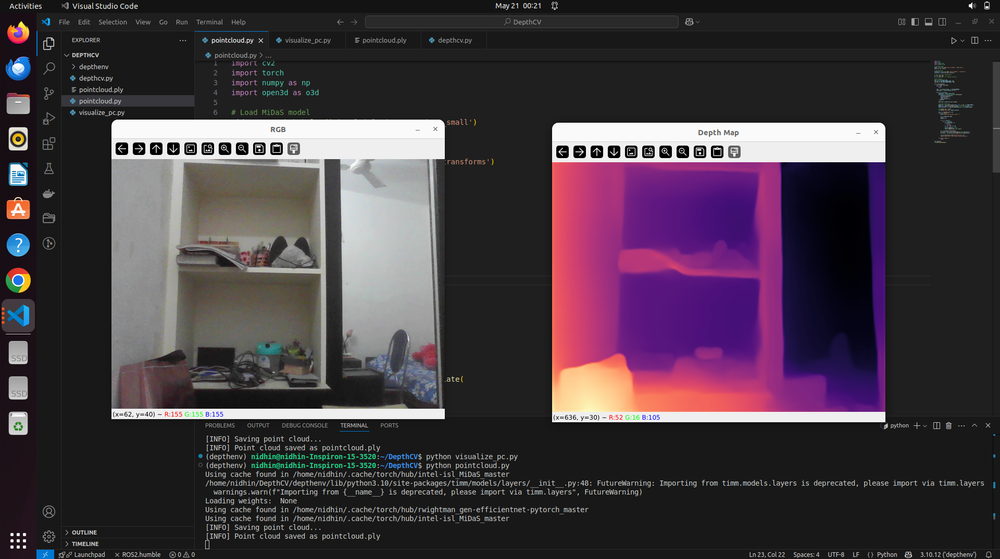
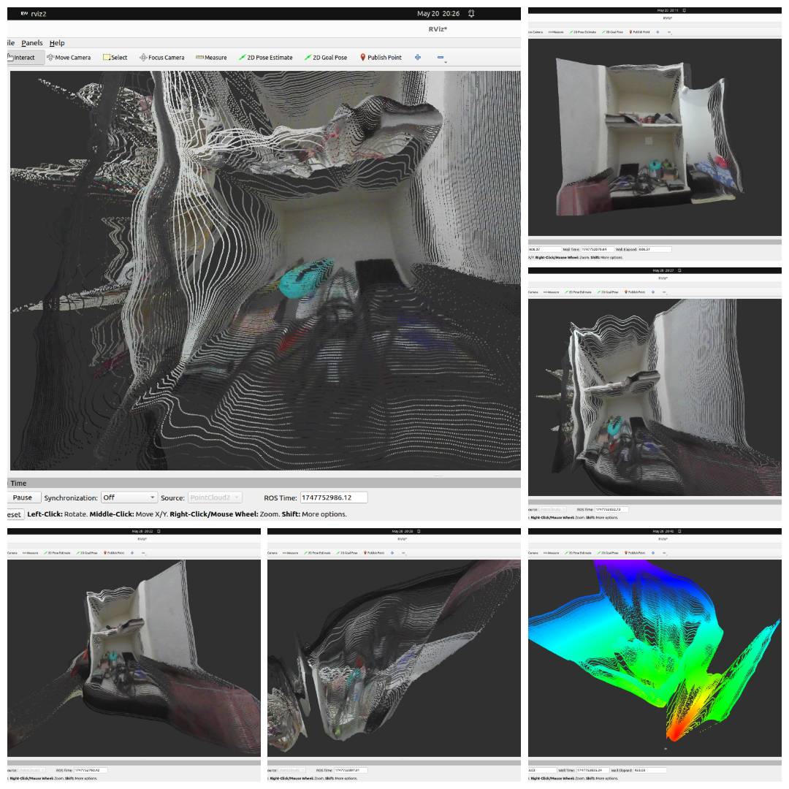

# Depth Estimation to 3D Point Cloud (ROS2 + MiDaS)

This ROS2 package generates real-time 3D point clouds from a standard RGB webcam using MiDaS, without requiring any depth camera like Intel RealSense or Kinect. It enables developers and researchers to simulate depth sensing and spatial perception affordably and efficiently.

## 📌 Why This Project?

Traditional depth cameras are expensive or not always available. With the power of deep learning (MiDaS), we can extract dense depth maps from a normal RGB camera feed and publish them as `sensor_msgs/PointCloud2` messages in ROS2.

This is particularly useful for:
- Research in robotics with minimal hardware
- Testing SLAM or 3D visualization stacks
- Educational and simulation environments

## 🎯 Features

- Real-time depth map estimation using MiDaS (DPT-Small)
- RGB-D to 3D Point Cloud generation using camera intrinsics
- Publishes standard `sensor_msgs/msg/PointCloud2`
- Viewable in **RViz2** with proper TF and frame setup

## 🧱 Package Structure
```text
depth_pointcloud_pub/
├── depth_pointcloud_pub/
│   ├── __init__.py
│   └── depth_node.py        # Main ROS2 Node
├── resource/
├── test/
├── package.xml
├── setup.cfg
└── setup.py
```

## 📸 Sample Output

### RGB Frame + Estimated Depth Map


### Visualized Point Cloud in RViz2


## 🚀 How It Works

1. **Capture RGB Frame:** From webcam using OpenCV.
2. **Estimate Depth:** Use MiDaS model (DPT-Small) via PyTorch.
3. **Backproject to 3D Points:** Using default camera intrinsics.
4. **Publish to ROS2:** As `sensor_msgs/msg/PointCloud2`.
5. **Visualize in RViz2:** With proper fixed frame and topic.

## ⚙️ Prerequisites

- Ubuntu 22.04
- ROS 2 Humble
- Python 3.10+
- OpenCV
- PyTorch
- `cv_bridge`, `sensor_msgs_py`
- MiDaS (automatically downloaded by `torch.hub`)

Install ROS 2 dependencies:
```bash
sudo apt install ros-humble-cv-bridge ros-humble-sensor-msgs-py
```
Install Python packages:
```bash
pip install opencv-python torch torchvision torchaudio
```
🧪 Run Instructions
Step 1: Build the ROS2 Package
```bash
cd ~/ros2_ws
colcon build --packages-select depth_pointcloud_pub
source install/setup.bash
```
Step 2: Launch the Depth Node
```bash
ros2 run depth_pointcloud_pub depth_node
```
Step 3: Set Up TF Tree (optional)
RViz2 needs a fixed frame to align your cloud. If camera_link is not part of the TF tree, publish a static transform:
```bash
ros2 run tf2_ros static_transform_publisher 0 0 0 0 0 0 map camera_link
```
Step 4: Visualize in RViz2
Launch rviz2:
```bash
rviz2
```

In Global Options, set Fixed Frame to camera_link
Add a new display of type PointCloud2
Set topic to /depth/pointcloud

## 🛠️ Customization

Modify camera intrinsics in depth_node.py if using a different resolution.
Switch MiDaS model (DPT_Large, DPT_Hybrid) for better quality (but higher GPU load).

## 🤖 Applications

3D reconstruction
Perception in low-cost robotics
Depth SLAM prototyping
Autonomous navigation and mapping

